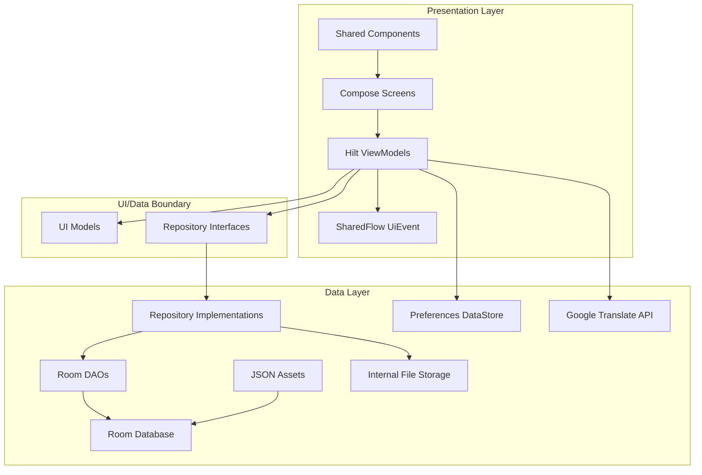
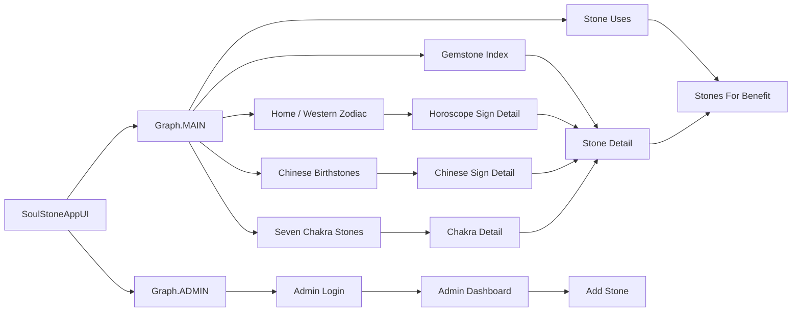
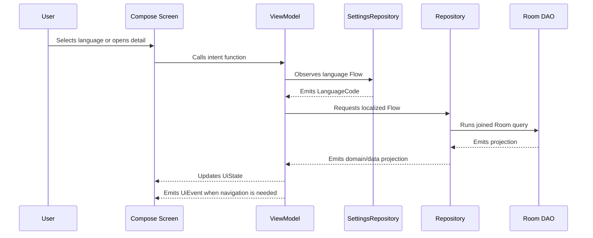
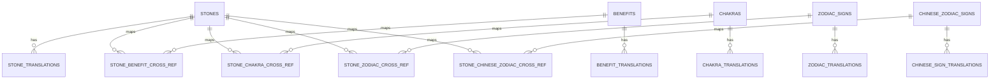
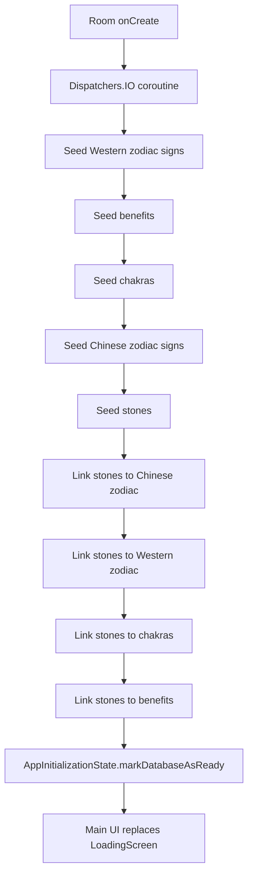
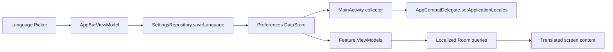
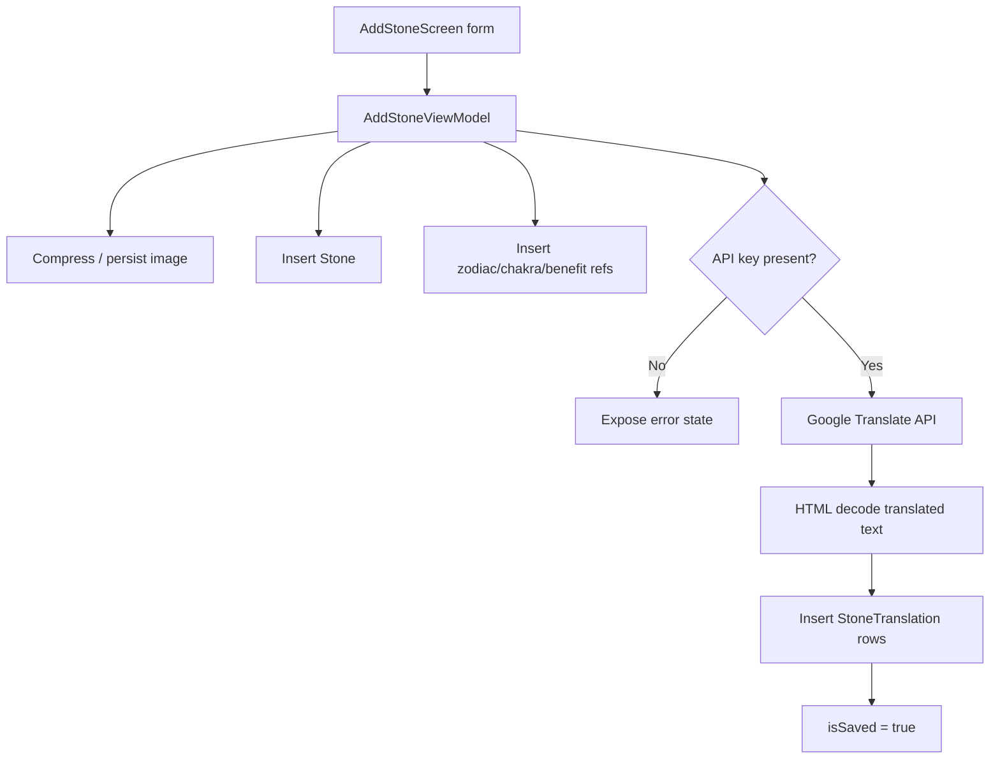

# SoulStone


**SoulStone** is a multilingual Android application for exploring gemstones through Western zodiac signs, Chinese zodiac signs, chakras, and practical stone benefits.

The project is not structured as a thin inspirational content app. It treats the content domain as a real relational system: stones are linked to multiple classification models, app copy and content translations are separated, user language is persisted, first-run data is seeded from JSON, and the UI reacts to Room-backed `Flow`s through ViewModels.

The result is a Compose application with a clear product shape, a normalized offline data model, and enough internal tooling to support content growth without turning the UI layer into a data-entry surface.

---

## Table of Contents

- [Product Intent](#product-intent)
- [Screenshots](#screenshots)
- [Feature Map](#feature-map)
- [Technology Stack](#technology-stack)
- [Project Structure](#project-structure)
- [Architecture](#architecture)
- [Navigation](#navigation)
- [State Management](#state-management)
- [Data Model](#data-model)
- [Offline-First Initialization](#offline-first-initialization)
- [Localization Strategy](#localization-strategy)
- [Admin and Content Creation](#admin-and-content-creation)
- [Security and Privacy](#security-and-privacy)
- [Local Development](#local-development)
- [Build and Test](#build-and-test)
- [Scalability Roadmap](#scalability-roadmap)
- [Key Engineering Decisions](#key-engineering-decisions)

---

## Product Intent

SoulStone is designed around a specific discovery problem: users may approach gemstones from different mental models.

- A user may start with a **birth date** and explore Western zodiac stones.
- A user may start with a **birth year** and explore Chinese zodiac stones.
- A user may start with a **chakra** and explore associated stones.
- A user may start with a **desired benefit** such as focus, calm, or protection.
- A user may browse the **gemstone index** directly.

Those entry points converge on the same underlying stone catalog. That is the main product and architecture decision: SoulStone models gemstones as reusable domain entities rather than duplicating static screen content.

---

## Screenshots

> Add production screenshots here once final device captures are available.

| Home / Western Zodiac | Chinese Zodiac | Chakra Detail |
| --- | --- | --- |
| `docs/screenshots/home.png` | `docs/screenshots/chinese-zodiac.png` | `docs/screenshots/chakra-detail.png` |

| Gemstone Index | Stone Detail | Admin Inventory |
| --- | --- | --- |
| `docs/screenshots/gemstone-index.png` | `docs/screenshots/stone-detail.png` | `docs/screenshots/admin-dashboard.png` |

---

## Feature Map

| Area | Implementation |
| --- | --- |
| Main discovery flows | Western zodiac, Chinese zodiac, chakra wheel, stone benefits, gemstone index |
| Detail pages | Localized sign/chakra/stone content with related stones and adjacent navigation |
| Persistence | Room database with normalized entities, translation tables, and cross-reference tables |
| First-run data | Seeded from structured JSON assets on database creation |
| Localization | Android resources for UI labels plus Room-backed translations for domain content |
| Language preference | Preferences DataStore exposed through `SettingsRepository.language` |
| Navigation | Root graph split into public app and admin graph |
| Admin tooling | Login, inventory dashboard, description editing, add-stone workflow |
| Image loading | Packaged drawable lookup first, internal file fallback through Coil |
| Resilience | App works from local Room data after first initialization; network is only needed for optional translation generation |
| Session reset | Inactivity timer navigates back to the main graph after five minutes |

---

## Technology Stack

| Layer | Choice | Why it fits this project |
| --- | --- | --- |
| Language | Kotlin | Strong Android-first language with coroutines, null-safety, and concise domain modeling |
| UI | Jetpack Compose + Material 3 | Declarative UI maps well to screen state and multilingual content updates |
| Navigation | Navigation Compose | Typed route objects are centralized in `AppScreen` and split by app/admin graph |
| State | ViewModel + StateFlow + SharedFlow | Persistent screen state is separated from one-shot navigation/snackbar events |
| Persistence | Room | Relational data is a strong fit for stones, translations, and many-to-many classifications |
| DI | Hilt | Keeps DAOs, repositories, services, and app-wide managers injectable and replaceable |
| Preferences | DataStore Preferences | Asynchronous, Flow-based persistence for language selection |
| Networking | Retrofit + Gson | Focused integration with Google Translate API for content creation |
| Images | Coil 3 | Compose-native async image loading for packaged resources and internal files |
| Build | Gradle Kotlin DSL + Version Catalog | Centralized dependency versions and maintainable build configuration |

---

## Project Structure

```text
app/src/main/java/com/example/soulstone/
├── data/
│   ├── dao/              # Room DAO queries and transactional insert helpers
│   ├── database/         # AppDatabase and JSON seeding callback
│   ├── entities/         # Room entities for base tables and translation tables
│   ├── models/           # JSON seed models
│   ├── pojos/            # Query projections returned by DAOs
│   ├── relations/        # Many-to-many cross-reference tables
│   ├── remote/           # Google Translate Retrofit contract
│   ├── repository/       # Repository interfaces and implementations
│   └── storage/          # Internal image persistence helper
├── di/                   # Hilt modules for database, repositories, and networking
├── domain/model/         # Persistence-independent domain models
├── ui/
│   ├── components/       # Shared Compose UI components
│   ├── events/           # One-shot UI events
│   ├── models/           # UI-specific mapped models
│   ├── navigation/       # App/admin graph definitions
│   ├── screens/          # Feature screens and ViewModels
│   └── theme/            # Compose theme configuration
└── util/                 # Language enum, image helpers, inactivity manager, scroll helpers
```

This structure keeps the code organized by responsibility rather than by Android file type. The UI layer depends on repositories and UI models; repositories depend on DAOs and storage/network helpers; Room owns persistence details.

---

## Architecture

SoulStone uses a pragmatic MVVM + Repository architecture. It is not a pure Clean Architecture implementation with use-case classes for every operation, because the current domain logic is still close to data retrieval and mapping. The boundaries are still intentional:

- **Compose screens** render immutable state and send user intents to ViewModels.
- **ViewModels** combine language, route arguments, and repository streams into screen-specific `UiState`.
- **Repositories** define a stable data contract for each aggregate area.
- **DAOs** perform SQL joins and return purpose-built projections.
- **Room** remains the local source of truth for domain content.



### Why this architecture works here

The most important complexity in SoulStone is not business rules; it is **content relationship management**. The architecture therefore optimizes for:

- localized queries without duplicating UI logic;
- many-to-many relationships between stones and several classification systems;
- reactive language changes;
- easy addition of new screens that reuse existing stone data;
- an admin workflow that writes to the same local database used by the public UI.

---

## Navigation

SoulStone has two top-level graphs:

- `Graph.MAIN`: public product experience.
- `Graph.ADMIN`: admin login, inventory, and add-stone tooling.

The inactivity manager emits a timeout event after five minutes without interaction. The root app graph responds by navigating back to `Graph.MAIN`, which is useful for kiosk-like or shared-device usage.



Routes are centralized in `AppScreen`, which keeps route strings and route builders close together:

```kotlin
object StoneDetails : AppScreen("stone_details/{stoneId}") {
    fun createRoute(stoneId: Int) = "stone_details/$stoneId"
}
```

---

## State Management

The project follows a consistent pattern across feature screens:

- `MutableStateFlow` holds persistent UI state.
- `StateFlow` is exposed read-only to Compose.
- `MutableSharedFlow<UiEvent>` emits one-shot effects such as navigation and snackbars.
- `flatMapLatest` reacts to language changes and re-queries localized content.
- `combine` merges content, related lists, route parameters, search state, and edit state.



Example patterns in the codebase:

- `StoneUsesViewModel` observes language and maps benefits to `BenefitUiItem`.
- `GemstoneIndexViewModel` observes language, maps stones into a paged grid model, and includes previous/next grid controls as typed UI items.
- `ChakraDetailsViewModel`, `ChineseSignDetailsViewModel`, and `HoroscopeSignDetailsViewModel` combine the selected entity, related stones, and adjacent selection lists.
- `AdminDashboardViewModel` combines Room inventory data with local search/edit state.

This is a good fit for Compose because recomposition is driven by immutable snapshots rather than manually mutating views.

---

## Data Model

SoulStone's Room schema is intentionally relational. A stone can belong to many benefits, many chakras, many Western zodiac signs, and many Chinese zodiac signs. Localized text is stored separately from stable entity keys.



### Important database choices

- Stable base entities use keys such as `Stone.name`, `ZodiacSign.name`, `Chakra.sanskritName`, and `ChineseZodiacSign.keyName`.
- Translation tables enforce uniqueness with `(entityId, languageCode)` indices.
- Translation rows cascade on parent deletion.
- Cross-reference tables use composite primary keys to prevent duplicate associations.
- DAO methods return typed projections such as `TranslatedStone`, `StoneListItem`, `TranslatedChakra`, and `StoneInventoryView` instead of exposing raw entities to every screen.

This keeps UI mapping smaller and makes localized querying explicit.

---

## Offline-First Initialization

The initial app database is populated from JSON assets:

```text
app/src/main/assets/
├── initial_zodiac_signs.json
├── initial_chinese_zodiac.json
├── initial_chakras.json
├── initial_benefits.json
├── initial_stones.json
├── initial_zodiac_associations.json
├── initial_chinese_associations.json
├── initial_chakra_associations.json
└── initial_benefit_associations.json
```

Initialization happens from the Room database callback:



`AppInitializationState` stores `is_db_setup` in private `SharedPreferences` and exposes a `StateFlow`. `MainActivity` shows `LoadingScreen` until the database is ready.

This makes the application usable from local data once seeded. Network access is not part of the normal reading path.

---

## Localization Strategy

SoulStone uses two localization mechanisms because the app has two kinds of text:

| Text type | Storage | Reason |
| --- | --- | --- |
| Static UI labels | Android `strings.xml` resources | Native Android locale handling and simple resource lookup |
| Domain content | Room translation tables | Queryable, editable, offline content for stones, signs, chakras, and benefits |

Supported languages are modeled by `LanguageCode`:

- English (`en`)
- Spanish (`es`)
- French (`fr`)
- Italian (`it`)
- German (`de`)
- Polish (`pl`)
- Russian (`ru`)

Language selection is persisted through DataStore. `MainActivity` observes the selected language and updates `AppCompatDelegate` application locales, while `LocalLanguage` provides the selected `LanguageCode` to the Compose tree.



---

## Admin and Content Creation

The admin graph contains:

- `AdminLoginScreen`
- `AdminDashboardScreen`
- `AddStoneScreen`

The dashboard reads a joined inventory projection from Room, maps category strings into UI lists, supports search, and allows English description edits.

The add-stone workflow:

1. Collects name, description, image, and selected relationships.
2. Compresses selected bitmap previews off the main thread.
3. Saves the final image into private internal storage.
4. Inserts the stone and cross-reference rows.
5. Uses Google Translate API to generate translations for each `LanguageCode`.
6. Falls back to English text if a translation request fails.
7. Stores all generated translations in Room.



### Important honesty about admin auth

The current admin login is local and hardcoded in `AdminLoginViewModel`. That is acceptable for a prototype or local portfolio app, but it is **not production authentication**. A production version should replace it with a server-validated identity flow or a platform credential system and remove hardcoded credentials from client code.

---

## Security and Privacy

Current implementation choices:

- `android:allowBackup="false"` disables Android full-app backup.
- Uploaded/selected stone images are stored in the app's private internal storage.
- The Google Translate API key is read from `local.properties` and injected through `BuildConfig`.
- Network permissions are limited to internet/network state for translation integration.
- Main content browsing uses local Room data and does not require sending user activity to a backend.

Known hardening work before production:

- Replace hardcoded admin credentials with real authentication.
- Do not ship a client-embedded Translate API key for public builds; proxy translation through a trusted backend or secure admin-only process.
- Replace `fallbackToDestructiveMigration()` with explicit Room migrations before user data matters.
- Review generated/release artifacts before publishing source to avoid committing APKs or local build outputs.
- Add stronger validation and duplicate handling around add-stone writes.

---

## Local Development

### Requirements

- Android Studio with recent Android Gradle Plugin support
- JDK 17 or newer
- Android SDK 36 installed
- Kotlin/Gradle sync enabled

### Clone

```bash
git clone https://github.com/<your-user>/<your-repo>.git
cd SoulStone
```

### Configure optional Google Translate support

The app can run without a translation key for normal browsing. The key is only needed for the admin add-stone translation workflow.

Create or update `local.properties`:

```properties
GOOGLE_TRANSLATE_API_KEY="your_api_key_here"
```

The quotes matter because the value is passed directly into a generated `BuildConfig.String` field.

### Run

```bash
./gradlew :app:assembleDebug
```

Then open the project in Android Studio and run the `app` configuration on an emulator or connected device.

### Recommended emulator

The current UI appears designed around a large landscape display.

- Resolution: `1920 x 1080`
- Orientation: landscape
- Density: around `320 dpi`

Smaller phones may expose layout pressure in some custom wheel/detail screens. That is a known responsive-design area to improve.

---

## Build and Test

### Build commands

```bash
./gradlew :app:assembleDebug
./gradlew :app:assembleRelease
```

### Unit tests

```bash
./gradlew :app:testDebugUnitTest
```

### Instrumented tests

```bash
./gradlew :app:connectedDebugAndroidTest
```

The repository includes Android test sources for DAO and repository behavior using an in-memory Room database. Some test files appear to reflect an older schema/API shape and should be refreshed alongside the current Room entities and DAO methods before treating the suite as authoritative CI coverage.

### Testing strategy to grow toward

- DAO tests for localized joins and many-to-many cross references.
- Repository tests with fake DAOs or in-memory Room.
- ViewModel tests for language switching, pagination, admin edit state, and API failure fallback.
- Compose UI tests for navigation flows and responsive layout.
- Migration tests once destructive migration is removed.

---

## Scalability Roadmap

| Area | Next step |
| --- | --- |
| Database evolution | Add explicit Room migrations and migration tests |
| Admin security | Replace local hardcoded credentials with a real authenticated admin boundary |
| Translation workflow | Move Translate API calls behind a backend or secured admin tool |
| Modularization | Split `:core:data`, `:core:designsystem`, and feature modules if the app grows |
| Responsive UI | Formalize compact/medium/expanded layouts for phone, tablet, and kiosk screens |
| Content QA | Add validation scripts for JSON seed referential integrity |
| Search | Add normalized search tables or FTS for larger stone catalogs |
| Observability | Add structured error reporting around seeding, translation failures, and admin writes |
| CI | Add Gradle build, lint, unit, and instrumentation test jobs |

---

## Key Engineering Decisions

### 1. Room as the source of truth

SoulStone's content is relational by nature. A stone can be associated with several benefits, chakras, and zodiac systems. Room gives the project SQL joins, transactions, uniqueness constraints, and reactive `Flow` queries without requiring a backend for the core browsing experience.

This choice also supports an offline-first product experience. Once seeded, the app reads from local storage and can render localized content without network access.

### 2. Translation tables instead of translated blobs

The app stores translations in dedicated tables such as `stone_translations`, `chakra_translations`, and `zodiac_translations`. This avoids duplicating entire entity graphs per language and allows DAOs to ask a precise question: "give me this entity in this language."

The tradeoff is more schema complexity. The benefit is cleaner querying, better uniqueness guarantees, and a path to adding languages without changing the public UI model.

### 3. DAO projections for screen-ready data

DAOs return projections like `TranslatedStone`, `StoneListItem`, and `StoneInventoryView`. This keeps screens from needing to understand every join table. It also makes query intent visible in the data layer: list screens get lightweight rows, while detail/admin screens get richer projections.

The tradeoff is that projection models can grow numerous. In this project that is reasonable because each projection maps to a real UI use case.

### 4. StateFlow for state, SharedFlow for effects

Persistent screen data lives in `StateFlow`; one-time events live in `SharedFlow<UiEvent>`. This prevents navigation and snackbar effects from being accidentally replayed as normal screen state and gives Compose a simple read model.

This pattern appears across the app bar, detail screens, admin login, dashboard, and index flows.

### 5. Split root navigation into public and admin graphs

The app separates discovery flows from admin flows at the root graph level. This keeps the public navigation model simpler and makes it possible to reset the app to the public graph after inactivity.

That structure is especially relevant because the app has kiosk-like qualities: large landscape UI, visual wheels, and a five-minute inactivity reset.

### 6. Hybrid image model: drawable first, internal file fallback

Seeded content references packaged drawable names. Admin-added content writes images into private internal storage. The shared `UniversalImage` component resolves either path and delegates rendering to Coil.

This keeps bundled content efficient while allowing runtime content creation without changing the APK.

### 7. JSON seed files as editable content source

The first-run seed data lives in JSON assets rather than hardcoded Kotlin lists. That makes the content easier to review and update independently from UI code. The tradeoff is that referential integrity is enforced at runtime during seeding, so future work should add validation tooling around those JSON files.

### 8. Early-stage migration strategy is intentionally simple

The database currently uses `fallbackToDestructiveMigration()`. That keeps iteration fast while the schema is still evolving, but it is not appropriate once user-created content is important. The natural next step is explicit Room migrations and migration tests.

### 9. Admin tooling exists, but production boundaries are not claimed

The admin flow demonstrates local content management, image persistence, translation generation, and inventory editing. It should be read as internal tooling inside the app, not as a secure production CMS. The README calls this out directly because the implementation is useful, but the boundary is intentionally not overstated.

---

## License

No license file is currently included. Add a license before distributing or accepting external contributions.
